<style>
.reveal section img { background:none; border:none; box-shadow:none; }
</style>

## Getting Started with Apache Spark

<a href="https://www.catallaxyservices.com">Kevin Feasel</a> (<a href="https://twitter.com/feaselkl">@feaselkl</a>)
<a href="https://csmore.info/on/spark">https://CSmore.info/on/spark</a>

---

@title[Who Am I?]

@div[left-60]
<table>
	<tr>
		<td><a href="https://csmore.info"></a></td>
		<td><a href="https://csmore.info">Catallaxy Services</a></td>
	</tr>
	<tr>
		<td><a href="https://curatedsql.com"></a></td>
		<td><a href="https://curatedsql.com">Curated SQL</a></td>
	</tr>
	<tr>
		<td><a href="https://www.apress.com/us/book/9781484254608"></a></td>
		<td><a href="https://www.apress.com/us/book/9781484254608">PolyBase Revealed</a></td>
	</tr>
</table>
@divend

@div[right-40]
	<br /><br />
	<a href="https://www.twitter.com/feaselkl"></a>
	<br />
	<a href="https://www.twitter.com/feaselkl">@feaselkl</a>
</div>
@divend

---

@title[The Origins Of Spark]

## Agenda

1. **The Origins of Spark**
2. Installing Spark
3. Functional Spark
4. Our First Examples
5. Spark SQL
6. Databricks UAP
7. .NET for Apache Spark

---?image=presentation/assets/background/elephant1.jpg&size=cover&opacity=20

### The Origins of Hadoop

Hadoop started as a pair of Google whitepapers: the Google File System (released in 2003) and MapReduce (2004). Doug Cutting, while working at Yahoo, applied these concepts to search engine processing.  The first public release of Hadoop was in early 2006.

Since then, Hadoop has taken off as its own ecosystem, allowing companies to process petabytes of data efficiently over thousands of machines.

---?image=presentation/assets/background/elephant2.jpg&size=cover&opacity=20

### Great Use Cases for Hadoop

* Processing gigantic numbers of records, where a single-server solution is cost prohibitive or unavailable.
* "Cold storage" of relational data, especially using Polybase.
* Real-time ETL and streaming of data.
* Statistical analysis of gigantic data sets.
* A central data repository (data lake), which can feed other sources (like warehouses).

---?image=presentation/assets/background/ram.jpg&size=cover&opacity=20

### The Birth of Hadoop:  2007-2011

The hardware paradigm during the early years:

* Many servers with direct attached storage.
* Storage was primarily spinning disk.
* Servers were held on-prem.
* Servers were phyiscal machines.
* There was some expectation of server failure.

This hardware paradigm drove technical decisions around data storage, including the Hadoop Distributed Filesystem (HDFS).

---?image=presentation/assets/background/greenscreen.jpg&size=cover&opacity=20

### The Birth of Hadoop:  2007-2011

The software paradigm during the early years:

* On Linux, C is popular but Java is more portable.
* RAM is much faster than disk but is limited.
* Network bandwidth is somewhat limited.
* Data structure is context-sensitive and the same file may have several structures.
* Developers know the data context when they write their code.

This led to node types, semi-structured data storage, and MapReduce.

---?image=presentation/assets/background/elephant3.jpg&size=cover&opacity=20

### Node Types in Hadoop

There are two primary node types in Hadoop: the NameNode and data nodes.

The **NameNode** (aka control or head node) is responsible for communication with the outside world, coordination with data nodes, and ensuring that jobs run.

**Data nodes** store data and execute code, making results available to the NameNode.

---?image=presentation/assets/background/data.jpg&size=cover&opacity=20

### Data Retrieval in Hadoop

Hadoop follows a "semi-structured" data model: you define the data structure not when adding files to HDFS, but rather upon retrieval. You can still do ETL and data integrity checks before moving data to HDFS, but it is not mandatory.

In contrast, a relational database has a structured data model:  queries can make good assumptions about data integrity and structure.

---

### Data Retrieval in Hadoop

Semi-structured data helps when:

* Different lines have different sets of values.
* Even if the lines are the same, different applications need the data aligned different ways.

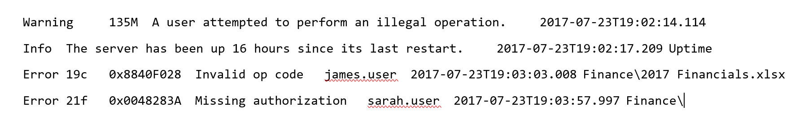

---?image=presentation/assets/background/map.jpg&size=cover&opacity=20

### MapReduce

MapReduce is built around two FP constructs:

* **Map**: filter and sort data
* **Reduce**: aggregate data

MapReduce combines map and reduce calls to transform data into desired outputs.

The nodes which perform mapping may not be the same nodes which perform reduction, allowing for large-scale performance improvement.

---?image=presentation/assets/background/elephant4.jpg&size=cover&opacity=20

### What Went Right?

* Able to process files too large for a single server
* Solved important problems for enormous companies
* Hadoop built up an amazing ecosystem
  - Databases:  HBase, Phoenix, Hive, Impala
  - Data movers:  Pig, Flume, Sqoop
  - Streaming:  Storm, Kafka, Spark, Flink

---?image=presentation/assets/background/elephant5.jpg&size=cover&opacity=20

### What Went Wrong?

* MapReduce can be SLOW – many reads and writes against slow spinning disk.
* Hardware changes over time stretched and sometimes broke Hadoop assumptions:
  - Spinning disk DAS >> SSD & SANs >> NVMe
  - **Much** more RAM on a single box (e.g., 2TB)
  - Physical hardware >> On-prem VM >> Cloud

Some of these changes precipitated the research project which became Apache Spark.

---?image=presentation/assets/background/sparkler.jpg&size=cover&opacity=20

### The Genesis of Spark

Spark started as a research project at the University of California Berkeley’s Algorithms, Machines, People Lab (AMPLab) in 2009.  The project's goal was to develop in-memory cluster computing, avoiding MapReduce's reliance on heavy I/O use.

The first open source release of Spark was 2010, concurrent with a paper from Matei Zaharia, et al.

In 2012, Zaharia, et al release a paper on Resilient Distributed Datasets.

---

### Resilient Distributed Datasets

The Resilient Distributed Dataset (RDD) forms the core of Apache Spark.  It is:

* Immutable – you never change an RDD itself; instead, you apply transformation functions to return a new RDD

---

### Resilient Distributed Datasets

The Resilient Distributed Dataset (RDD) forms the core of Apache Spark.  It is:

* Immutable
* Distributed – executors (akin to data nodes) split up the data set into sizes small enough to fit into those machines’ memory

---

### Resilient Distributed Datasets

The Resilient Distributed Dataset (RDD) forms the core of Apache Spark.  It is:

* Immutable
* Distributed
* Resilient – in the event that one executor fails, the driver (akin to a name node) recognizes this failure and enlists a new executor to finish the job

---

### Resilient Distributed Datasets

The Resilient Distributed Dataset (RDD) forms the core of Apache Spark.  It is:

* Immutable
* Distributed
* Resilient
* Lazy – Executors try to minimize the number of data-changing operations

Add all of this together and you have the key component behind Spark.

---

@title[Installing Spark]

## Agenda

1. The Origins of Spark
2. **Installing Spark**
3. Functional Spark
4. Our First Examples
5. Spark SQL
6. Databricks UAP
7. .NET for Apache Spark

---?image=presentation/assets/background/construction.jpg&size=cover&opacity=20

### Installation Options

We have several options available to install Spark:

* Install stand-alone (Linux, Windows, or Mac)
* Use with a Hadoop distribution like Cloudera or Hortonworks
* Use Databricks Unified Analytics Platform on AWS or Azure
* Use with a Hadoop PaaS solution like Amazon ElasticMapReduce or Azure HDInsight

We will look at the first three in this talk.

---

### Install Spark On Windows

Step 1:  Install the <a href="https://www.oracle.com/technetwork/java/javase/downloads/index.html">Java Development Kit</a>.  I recommend getting Java Version 8.  Spark is currently not compatible with JDKs after 8.

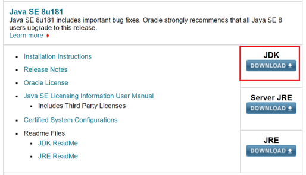

---

### Install Spark On Windows

Step 2:  Go to <a href="http://spark.apache.org/downloads.html">the Spark website</a> and download a pre-built Spark binary.


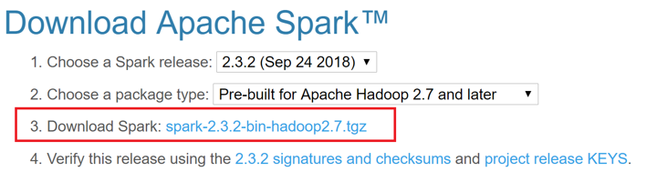

You can unzip this .tgz file using a tool like 7-Zip.

---

### Install Spark On Windows

Step 3:  <a href="https://github.com/steveloughran/winutils/blob/master/hadoop-2.8.3/bin/winutils.exe">Download WinUtils</a>.  This is the 64-bit version and should be 110KB.  There is a 32-bit version which is approximately 43KB; it will **not** work with 64-bit Windows!  Put it somewhere like C:\spark\bin\.

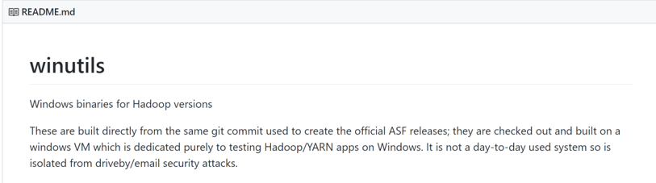

---

### Install Spark On Windows

Step 4: Create c:\tmp\hive and open up permissions to everybody. 


---

### Install Spark On Windows

Step 5:  Create environment variables:

@div[left-50]
**SPARK_HOME** >> `C:\spark`<br />
**HADOOP_HOME** >> (where winutils is)<br />
**JAVA_HOME** >> (where you installed Java)<br />
**PATH** >> `;%SPARK_HOME%\bin; %JAVA_HOME%\bin;`
@divend

@div[right-50]
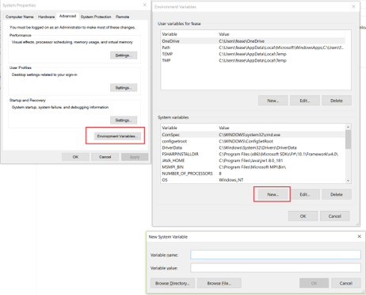
@divend 

---

### Install Spark On Windows

Step 6: Open the `conf` folder and create & modify `log4j.properties`.

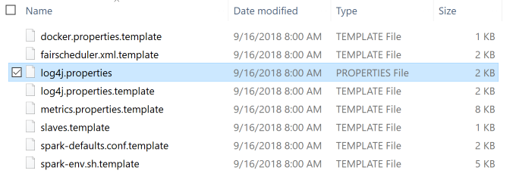

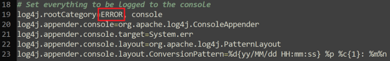

---

### Install Spark On Windows

Step 7:  In the bin folder, run `spark-shell.cmd`.  Type `Ctrl-D` to exit the shell.


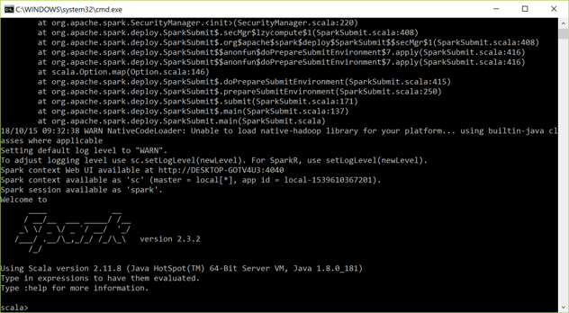

---

### Use A Hadoop Distribution

The <a href="https://hortonworks.com/products/sandbox/">Hortonworks Data Platform sandbox</a> and <a href="https://www.cloudera.com/downloads/quickstart_vms/5-13.html">Cloudera QuickStart VM</a> both include Apache Spark and Apache Spark 2.


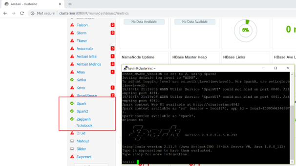

---

@title[Functional Spark]

## Agenda

1. The Origins of Spark
2. Installing Spark
3. **Functional Spark**
4. Our First Examples
5. Spark SQL
6. Databricks UAP
7. .NET for Apache Spark

---?image=presentation/assets/background/colored-pencils.jpg&size=cover&opacity=20

### Why Scala?

Spark supports Scala, Python, and Java as primary languages and R and SQL as secondaries.  We will use Scala because:

1. Spark is written in Scala.
2. Functionality comes out in the Scala API first.
3. Scala is terser than Java but still readable.
4. Scala is typically faster than Python.
5. Scala is a functional programming language, which fits the data platform mindset better.

If you prefer Python or Java, that’s fine. 

---?image=presentation/assets/background/arrow.jpg&size=cover&opacity=20

### Functional Programming In Brief

Relevant functional programming concepts:

```r
def parseLine(line:String) { line.toString().split(",")(3); }
val rdd = lines.map(parseLine)
val rdd = lines.map(x => x.toString().split(",")(3))
```

@[1](Functions are the key control structure.)
@[2](Functions can accept functions as parameters.)
@[3](We can define inline, anonymous functions called lambda expressions.)
@[1-3](We can build bottom-up solutions iteratively, rather than needing to know everything up front.)

---?image=presentation/assets/background/koala.jpg&size=cover&opacity=20

### Transformations

Transformations take inputs and return an RDD or DataSet.  Transformations are lazily evaluated, making Spark processing more efficient.

@table[table-header table-tsv text-07](presentation/assets/tsv/transformations.txt)

---?image=presentation/assets/background/cat-yawning.jpg&size=cover&opacity=20

### Set Transformations

* `rdd1.distinct()`
* `rdd1.union(rdd2)`
* `rdd1.intersection(rdd2)`
* `rdd1.subtract(rdd2)` – Akin to the `EXCEPT` operator in SQL
* `rdd1.cartesian(rdd2)` – Cartesian product (`CROSS JOIN` in SQL)

Warning:  set operations can be slow in Spark depending on data sizes and whether data needs to be shuffled across nodes.

---?image=presentation/assets/background/jump.jpg&size=cover&opacity=20

### Actions

Actions take RDDs as inputs and return something other than an RDD or DataSet.  Actions cause Spark to evaluate all transformations and return.

@table[table-header table-tsv text-07](presentation/assets/tsv/actions.txt)

---?image=presentation/assets/background/utv.jpg&size=cover&opacity=20

### More Actions

Actions take RDDs as inputs and return something other than an RDD or DataSet.  Actions cause Spark to evaluate all transformations and return.

@table[table-header table-tsv text-07](presentation/assets/tsv/moreactions.txt)

---

@title[Our First Examples]

## Agenda

1. The Origins of Spark
2. Installing Spark
3. Functional Spark
4. **Our First Examples**
5. Spark SQL
6. Databricks UAP
7. .NET for Apache Spark

---?image=presentation/assets/background/restaurant.jpg&size=cover&opacity=20

### Where To Eat?

We will analyze food service inspection data for the city of Durham.  We want to answer a number of questions about this data, including average scores and splits between classic restaurants and food trucks.

---?image=presentation/assets/background/demo.jpg&size=cover&opacity=20

### Demo Time

---

@title[Spark SQL]

## Agenda

1. The Origins of Spark
2. Installing Spark
3. Functional Spark
4. Our First Examples
5. **Spark SQL**
6. Databricks UAP
7. .NET for Apache Spark

---?image=presentation/assets/background/frame.jpg&size=cover&opacity=20

### The Evolution of Spark

One of the first additions to Spark was SQL support, first with Shark and then with Spark SQL.

With Apache Spark 2.0, Spark SQL can take advantage of Datasets (strongly typed RDDs) and DataFrames (Datasets with named columns).

Spark SQL functions are accessible within the SparkSession object, created by default as “spark” in the Spark shell.

---?image=presentation/assets/background/chain.jpg&size=cover&opacity=20

### The Functional Approach

**Functions** provide us with SQL-like operators which we can chain together in Scala, similar to how we can use LINQ with C#.  These functions include (but are not limited to) `select()`, `distinct()`, `where()`, `join()`, and `groupBy()`.

There are also functions you might see in SQL Server like `concat()`, `concat_ws()`, `min()`, `max()`, `row_number()`, `rank()`, and `dense_rank()`.

---?image=presentation/assets/background/magnifying-glass.jpg&size=cover&opacity=20

### Queries

**Queries** are exactly as they sound:  we can write SQL queries.  Spark SQL strives to be ANSI compliant with additional functionality like sampling and user-defined aggregate functions.

Spark SQL tends to lag a bit behind Hive, which lags a bit behind the major relational players in terms of ANSI compliance.  That said, Spark SQL has improved greatly since version 1.0.

---?image=presentation/assets/background/movie.jpg&size=cover&opacity=20

### Querying The MovieLens Data

GroupLens Research has made available their MovieLens data set which includes 20 million ratings of 27K movies.

We will use Apache Spark with Spark SQL to analyze this data set, letting us look at frequently rated movies, the highest (and lowest) rated movies, and common movie genres.

---?image=presentation/assets/background/demo.jpg&size=cover&opacity=20

### Demo Time

---

@title[Databricks UAP]

## Agenda

1. The Origins of Spark
2. Installing Spark
3. Functional Spark
4. Our First Examples
5. Spark SQL
6. **Databricks UAP**
7. .NET for Apache Spark

---

### Databricks UAP

@div[left-50]
Databricks, the commercial enterprise behind Apache Spark, makes available the Databricks Unified Analytics Platform in <a href="https://databricks.com/aws">AWS</a> and <a href="https://databricks.com/product/azure">Azure</a>.  They also have a <a href="https://community.cloud.databricks.com/">Community Edition</a>, available for free.

@divend

@div[right-50]
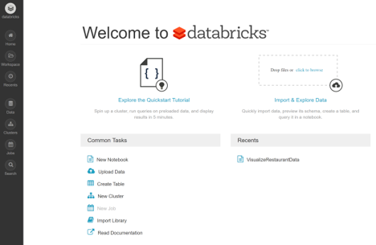
@divend 

---

### Databricks UAP

@div[left-50]
Clusters are 1 node & 6 GB RAM running on spot instances of AWS.<br />

Data sticks around after a cluster goes away, and limited data storage is free.<br />
@divend

@div[right-50]
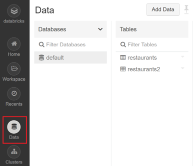
@divend 

---

### Databricks UAP

Create a Zeppelin notebook and attach it to a running cluster. Notebooks stick around after the cluster goes away.

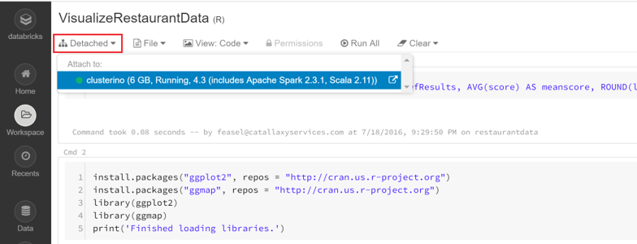

---

### Databricks UAP

Zeppelin comes with a good set of built-in, interactive plotting options.

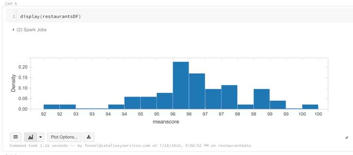

---

### Databricks UAP

Your cluster terminates after 2 hours of inactivity. You can also terminate the cluster early.

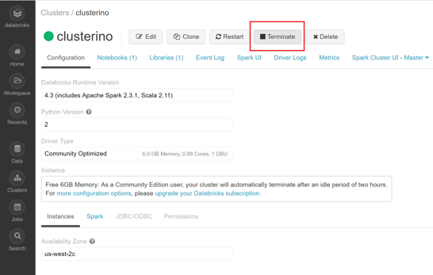

---

@title[.NET for Apache Spark]

## Agenda

1. The Origins of Spark
2. Installing Spark
3. Functional Spark
4. Our First Examples
5. Spark SQL
6. Databricks UAP
7. **.NET for Apache Spark**

---

### dotnet-spark

Microsoft has official support for Spark running on .NET.  They support the C# and F# languages.

With .NET code, you are limited to DataFrames and Spark SQL, so no direct access to RDDs.

---?image=presentation/assets/background/demo.jpg&size=cover&opacity=20

### Demo Time

---?image=presentation/assets/background/excavator.jpg&size=cover&opacity=20

@title[What's Next]

### What's Next

We've only scratched the surface of Apache Spark.  From here, check out:

* MLLib, a library for machine learning algorithms built into Spark
* SparkR and sparklyr, two R libraries designed for distributed computing
* GraphX, a distributed graph database 
* Spark Streaming, allowing “real-time” data processing

---

### Wrapping Up

To learn more, go here:  <a href="https://csmore.info/on/spark">https://CSmore.info/on/spark</a>

And for help, contact me:  <a href="mailto:feasel@catallaxyservices.com">feasel@catallaxyservices.com</a> | <a href="https://www.twitter.com/feaselkl">@feaselkl</a>
