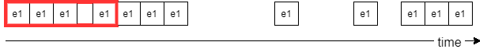
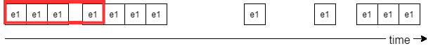
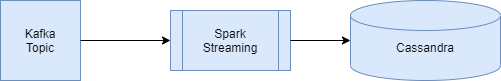

<style>
.reveal section img { background:none; border:none; box-shadow:none; }
</style>

## Getting Started with Spark Streaming

<a href="https://www.catallaxyservices.com">Kevin Feasel</a> (<a href="https://twitter.com/feaselkl">@feaselkl</a>)
<a href="https://csmore.info/on/sparkstreaming">https://CSmore.info/on/sparkstreaming</a>

---

@title[Who Am I?]

@div[left-60]
<table>
	<tr>
		<td><a href="https://csmore.info"></a></td>
		<td><a href="https://csmore.info">Catallaxy Services</a></td>
	</tr>
	<tr>
		<td><a href="https://curatedsql.com"></a></td>
		<td><a href="https://curatedsql.com">Curated SQL</a></td>
	</tr>
	<tr>
		<td><a href="https://www.apress.com/us/book/9781484254608"></a></td>
		<td><a href="https://www.apress.com/us/book/9781484254608">PolyBase Revealed</a></td>
	</tr>
</table>
@divend

@div[right-40]
	<br /><br />
	<a href="https://www.twitter.com/feaselkl"></a>
	<br />
	<a href="https://www.twitter.com/feaselkl">@feaselkl</a>
</div>
@divend

---

@title[The Origins Of Spark]

## Agenda

1. **The Origins of Spark**
2. What is Spark Streaming?
3. Our First Streaming Example
4. A Full Program
5. .NET and Spark Streaming

---?image=presentation/assets/background/sparkler.jpg&size=cover&opacity=20

### The Genesis of Spark

Spark started as a research project at the University of California Berkeley’s Algorithms, Machines, People Lab (AMPLab) in 2009.  The project's goal was to develop in-memory cluster computing, avoiding MapReduce's reliance on heavy I/O use.

The first open source release of Spark was 2010, concurrent with a paper from Matei Zaharia, et al.

In 2012, Zaharia, et al release a paper on Resilient Distributed Datasets.

---

### Resilient Distributed Datasets

The Resilient Distributed Dataset (RDD) forms the core of Apache Spark.  It is:

* Immutable – you never change an RDD itself; instead, you apply transformation functions to return a new RDD

---

### Resilient Distributed Datasets

The Resilient Distributed Dataset (RDD) forms the core of Apache Spark.  It is:

* Immutable
* Distributed – executors (akin to data nodes) split up the data set into sizes small enough to fit into those machines’ memory

---

### Resilient Distributed Datasets

The Resilient Distributed Dataset (RDD) forms the core of Apache Spark.  It is:

* Immutable
* Distributed
* Resilient – in the event that one executor fails, the driver (akin to a name node) recognizes this failure and enlists a new executor to finish the job

---

### Resilient Distributed Datasets

The Resilient Distributed Dataset (RDD) forms the core of Apache Spark.  It is:

* Immutable
* Distributed
* Resilient
* Lazy – Executors try to minimize the number of data-changing operations

Add all of this together and you have the key component behind Spark.

---

@title[What is Spark Streaming?]

## Agenda

1. The Origins of Spark
2. **What is Spark Streaming?**
3. Our First Streaming Example
4. A Full Program
5. .NET and Spark Streaming

---

Conceptually, Spark Streaming allows us to work with Resilient Distributed Datasets over time.


([Image Source](https://docs.microsoft.com/en-us/azure/databricks/getting-started/spark/streaming))

---


([Image Source](https://docs.microsoft.com/en-us/azure/databricks/getting-started/spark/streaming))

---

### DStreams and Microbatches

DStreams are simply time-aware RDDs.  Instead of using backward-looking historical data, we use forward-looking near-present data.

To maximize performance, Spark tends to wait a certain amount of time and build a microbatch--this reduces the cost of processing overhead by packing more than one record into a DStream.

---?image=presentation/assets/background/frame.jpg&size=cover&opacity=20

### DataFrames

With Apache Spark 2.0, the model shifted from Resilient Distributed Datasets to Datasets and DataFrames.

Datasets are strongly-typed RDDs.

DataFrames are Datasets with named columns (`Dataset[Row]` in Scala).  DataFrames are untyped in Python and R, and in all languages slice data into named columns.

---

### DataFrames

Datasets and DataFrames provide several advantages over RDDs:

* Native SQL support
* Compile-time errors
* The ability to structure data in code
* (Sometimes) better performance

---

### A Brief Primer on Windows

Spark Streaming has two key types of windows:  tumbling and sliding.  Suppose we have events which happen over time:


---

### Tumbling Windows

In a **tumbling window**, we have non-overlapping intervals of events captured during a certain time frame.



---

### Sliding Windows

In a **sliding window**, we have potentially-overlapping intervals.  We have a window length (in units of time) and a sliding window interval (in units of time).



---

@title[Our First Streaming Example]

## Agenda

1. The Origins of Spark
2. What is Spark Streaming?
3. **Our First Streaming Example**
4. A Full Program
5. .NET and Spark Streaming

---?image=presentation/assets/background/colored-pencils.jpg&size=cover&opacity=20

### Hello World:  DStream

```scala
val ssc = new StreamingContext("local[*]", "HelloSparkStreaming", Seconds(1))
val lines = ssc.socketTextStream("127.0.0.1", 9999, StorageLevel.MEMORY_ONLY)
val wordCounts = lines.flatMap(line => line.split(' '))
	.map(word => word.toLowerCase())
	.countByValueAndWindow(Seconds(30), Seconds(5))
wordCounts
	.transform(rdd => rdd.sortBy(_._2, false))
	.print(10)
```

@[1](Create a context with a 1-second batch size.)
@[2](Open a socket stream to port 9999.)
@[3-5](Count of appearances of a word over a 30-second window, sliding every 5.)
@[6-8](Print the 10 most common words.)

---?image=presentation/assets/background/arrow.jpg&size=cover&opacity=20

### Hello World:  DataFrame

```scala
val spark:SparkSession = SparkSession.builder()
	.master("local[3]")
	.appName("HelloSparkStreaming_DataFrame")
	.getOrCreate()
val df = spark.readStream
	.format("socket")
	.option("host","127.0.0.1")
	.option("port","9999")
	.load()
val count = df
	.select(explode(split(df("value")," "))
	.alias("word"))
	.groupBy("word")
	.count()
val query = count.writeStream
	.format("console")
	.outputMode("complete")
	.start()
	.awaitTermination()
```

@[1-4](Open a new Spark session.)
@[5-9](Open a socket stream to port 9999.)
@[10-14](Count of appearances of a word over the default frame.)
@[15-19](Write outputs to console until stopped.)

---?image=presentation/assets/background/demo.jpg&size=cover&opacity=20

### Demo Time

---

@title[A Full Program]

## Agenda

1. The Origins of Spark
2. What is Spark Streaming?
3. Our First Streaming Example
4. **A Full Program**
5. .NET and Spark Streaming

---?image=presentation/assets/background/restaurant.jpg&size=cover&opacity=20

### Cars:  a Story in Three Services

Our company has automobile data stored in an Apache Kafka topic.  We'd like to migrate that data over to a Cassandra database for analysis.  With Spark Streaming, we can do this easily.



---?image=presentation/assets/background/demo.jpg&size=cover&opacity=20

### Demo Time

---

@title[.NET and Spark Streaming]

## Agenda

1. The Origins of Spark
2. What is Spark Streaming?
3. Our First Streaming Example
4. A Full Program
5. **.NET and Spark Streaming**

---?image=presentation/assets/background/frame.jpg&size=cover&opacity=20

### Capabilities

Microsoft.Spark allows us to execute code in .NET DLLs or executables against Spark clusters.  Key functionality:

* Both C# and F# are supported.
* Use the DataFrames API for Spark Structured Streaming.
* Import additional libraries using Maven.
* Debugging is possible from within Visual Studio and Visual Studio Code.

---?image=presentation/assets/background/chain.jpg&size=cover&opacity=20

### Limitations

* No support for DStreams.
* Support for Spark versions tends to lag.
* Error handling can be a pain.

---?image=presentation/assets/background/magnifying-glass.jpg&size=cover&opacity=20

### Approach

* Build .NET code in Visual Studio / VS Code.
* Build a Docker container with .NET Core + Java and install Spark.
* Run the `spark-submit` command, sending all necessary parameters.

---?image=presentation/assets/background/demo.jpg&size=cover&opacity=20

### Demo Time

---

@title[What's Next]

### What's Next

We've only scratched the surface of Spark Streaming.  Additional topics of interest include:

* Watermarking and late-arriving data
* Checkpoints and recovery from failure
* Window functions in Spark SQL

---

### Wrapping Up

To learn more, go here:  <a href="https://csmore.info/on/sparkstreaming">https://CSmore.info/on/sparkstreaming</a>

And for help, contact me:  <a href="mailto:feasel@catallaxyservices.com">feasel@catallaxyservices.com</a> | <a href="https://www.twitter.com/feaselkl">@feaselkl</a>
